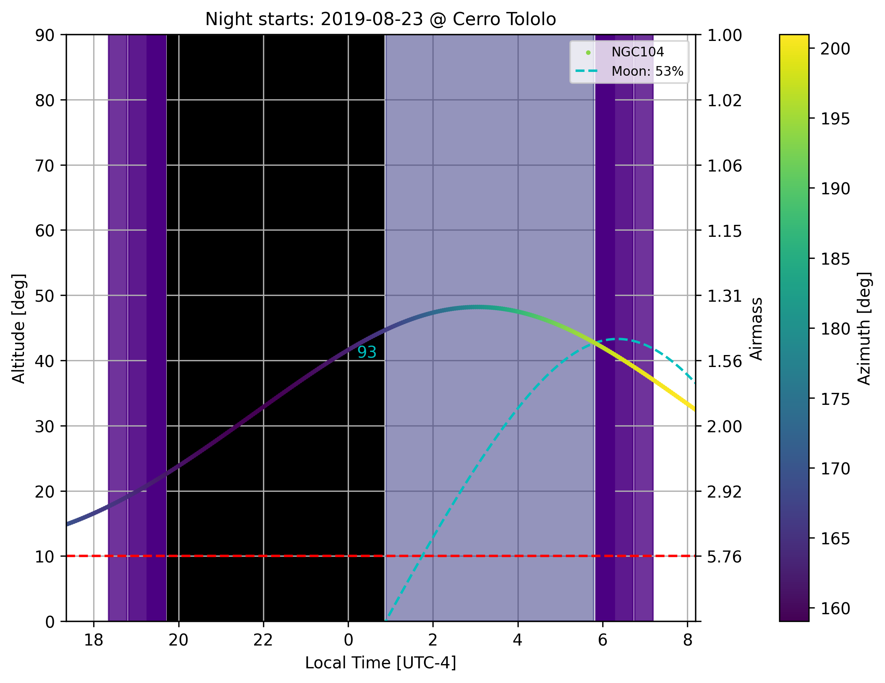
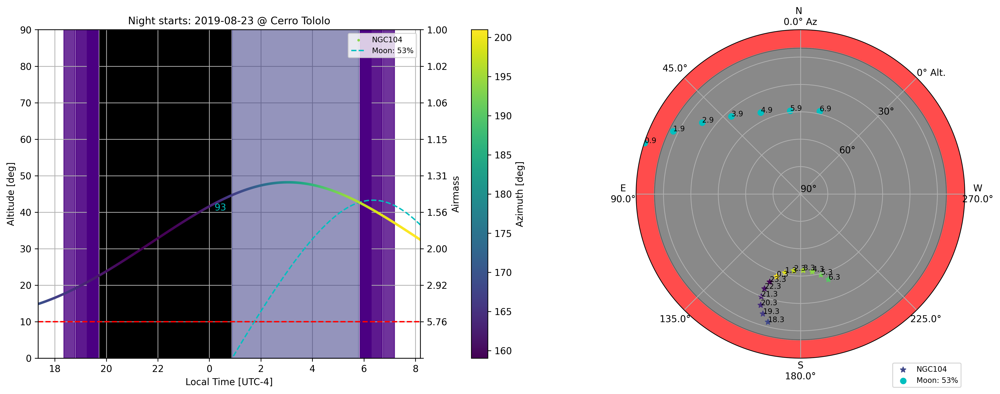
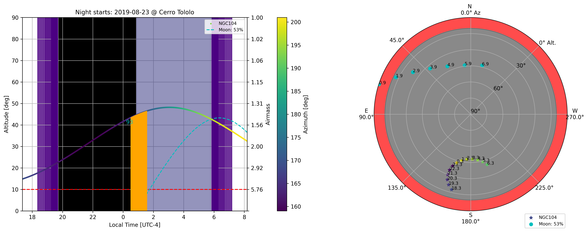
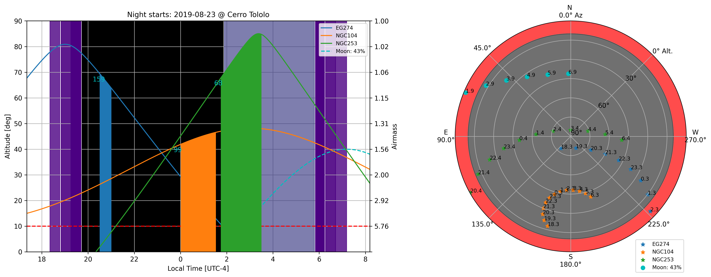
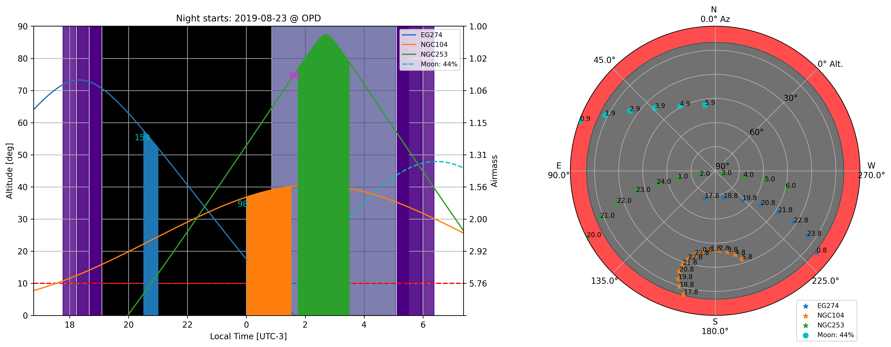
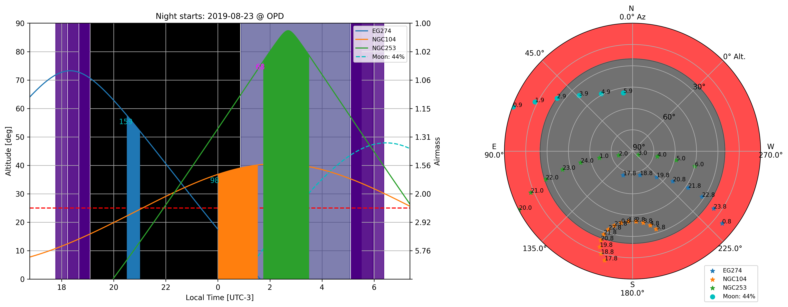

SkyWalker - Python observation planner tool
===========================================

By Herpich F. R.  

This tool can be used to plan the nights for virtually any observatory on the Planet. The user can make maps for individual objects or lists containing several of them. It is also possible to define time blocks for every object (individual or in a list). The angular distance to the Moon will always be shown at the given initial time for each object (if none is given, the default is 0 LT).

Usage
-----

- to get the full set of options available with the full description:

``skywalker --help``

(if you did not install the package, you can also run it in place with ``python -m skywalker --help`` from the ``src`` directory, or ``python src/skywalker/cli.py --help`` from the repository root)

Requisites
----------

``python >= 3.9``

``pandas``
``timezonefinder``
``pytz``
``numpy``
``matplotlib``
``astropy``
``astroplan``

This code uses a modified version of the Astroplan code (https://astroplan.readthedocs.io/en/latest/). If you use this code in your research, please cite accordingly (see https://github.com/astropy/astroplan for the full reference provided by the authors).

Installation
------------

The package was only tested on Python 3.9 and above on Linux systems. There is no plans to make it work on Windows or MacOS.

Clone the repository:

``git clone https://github.com/herpichfr/skywalker.git``

Into the repository, the package can be installed with pip (preferably inside a virtual environment):

``pip install .``

or, for an editable install while developing:

``pip install -e .``

This pulls in all dependencies, including the required fork of ``astroplan``, and installs a ``skywalker`` console command.

To also be able to save interactive HTML figures with ``--savehtml`` (see below), install the optional ``html`` extra, which pulls in ``plotly``:

``pip install -e '.[html]'``

To use the interactive web UI (``--web``, see below), install the ``web`` extra instead, which pulls in ``plotly`` and ``dash``:

``pip install -e '.[web]'``

Alternatively, the ``install.sh`` helper script can create a virtual environment and install the package into it for you.

To check for basic system requirements (Python 3, pip, venv), run:

``bash install.sh --check``

To create a virtual environment and install the package into it, run (do not run the command with sudo):

``bash install.sh --install``

This will create a python virtual environment and install the package and its dependencies in it, activating it if the install is successful.

To uninstall the package, run:

``bash install.sh --uninstall``

Right Ascension format
-----------------------

RA can be given as a decimal degree, sexagesimal degrees, or hourangle (the near-universal
convention for RA). skywalker auto-detects which one you mean from explicit unit markers
(e.g. ``16h23m33.78s`` or ``245.89d``) or, for a bare number, from its range (anything above
24 can only be degrees). A value that could be read either way (e.g. ``16:23:33.78`` or
``16.39``) is rejected with an error naming both readings; pass ``--raunit hour`` or
``--raunit deg`` to force one, or write the value with explicit units.

Note for anyone with plots made before this fix: sexagesimal RA used to be read as degrees
regardless of format, which silently mis-plotted hourangle values (e.g. ``16:23:33.78``,
meant as 16h23m, was read as 16°23' -- off by up to 90°). Figures made with ``--raunit deg``
kept that reading; anything else should be regenerated.

Usage examples
--------------

* Showing the track for NGC104 for Cerro Tololo and its distance to the Moon at 0:30 LT

``skywalker --object NGC104 --site 'Cerro Tololo' -ns 2019-08-23 --time 0:30:00 --savefig --figname test01``

* Showing the skychart for the same track

``skywalker --object NGC104 --site 'Cerro Tololo' -ns 2019-08-23 --time 0:30:00 --skychart --savefig --figname test02``

   
* Adding an observing block starting at 0:30 LT for NGC104 at Cerro Tololo

``skywalker --object NGC104 --site 'Cerro Tololo' -ns 2019-08-23 --time 0:30:00 --blocktime 3851 --skychart --savefig --figname test03``

* Showing all tracks of a list of objects for Cerro Tololo

``skywalker -f examples/example_file.csv --site 'Cerro Tololo' -ns 2019-08-23 --skychart --savefig --figname test04``

* Showing all tracks of a list of objects for a given observatory provided by the sitefile

``skywalker -f examples/example_file.csv --sitefile examples/sitefilename_example.csv -ns 2019-08-23 --skychart --savefig --figname test05``

* Including an altitude/airmass limit to the observations

``skywalker -f examples/example_file.csv --sitefile examples/sitefilename_example.csv -ns 2019-08-23 --skychart --minalt 25 --savefig --figname test06``

Interactive hover
-----------------

When the figure is shown in an interactive window (i.e. not with a headless/``Agg``
backend), moving the mouse over the altitude panel or the skychart shows a vertical time
cursor with a sliding marker on every plotted track, and a box listing the hovered time
plus the altitude and airmass of every object (and the Moon). Pass ``--no-hover`` to
disable it; it has no effect on saved figures, which are unaffected either way.

Interactive HTML export
------------------------

Since a saved PNG can never hover, ``--savehtml`` writes a self-contained interactive
HTML version of the figure (requires the ``html`` extra, see Installation above): hovering
it in a browser shows the same vertical time cursor and per-object readout as the
interactive window, including on the skychart panel.

``skywalker -f examples/example_file.csv --sitefile examples/sitefilename_example.csv -ns 2019-08-23 --skychart --savehtml``

By default the HTML file embeds ``plotly.js`` so it opens with no internet connection,
which is the point at an observatory. Use ``--htmlname`` to choose the output file (default
is ``skywalker_<nightstarts>.html``), and ``--htmljs cdn`` for a much smaller file that
loads ``plotly.js`` from a CDN instead (needs internet to view).

Interactive web UI
-------------------

``--web`` serves the same plot with a target table below it (requires the ``web`` extra,
see Installation above), letting you include or remove targets live, or add a new one by
name (looked up online) or by RA/Dec (works with no internet) while looking at the night:

``skywalker -f examples/example_file.csv --sitefile examples/sitefilename_example.csv -ns 2019-08-23 --skychart --web``

Then open the printed URL (``http://127.0.0.1:8050/`` by default) in a browser. The table
lets you select all/none/invert, click a row to highlight its track in the plot, and copy
or download the current selection as a CSV in skywalker's own format (decimal-degree RA/Dec,
so it round-trips into ``skywalker -f`` with no ``--raunit`` needed). Every browser tab
connected shares the same target list. ``--web`` binds to loopback (``127.0.0.1``) by
default; for remote access, tunnel to it (``ssh -L 8050:localhost:8050 user@host``) rather
than binding a public interface, since the app has no authentication in front of it. Object
name lookups are cached to disk, so resolving names once online makes them work offline
later.

## License

This code is licensed under the [GNU v3.0 License](LICENSE).

## Author

[Herpich F. R.](https://orcid.org/0000-0001-7907-7884)
