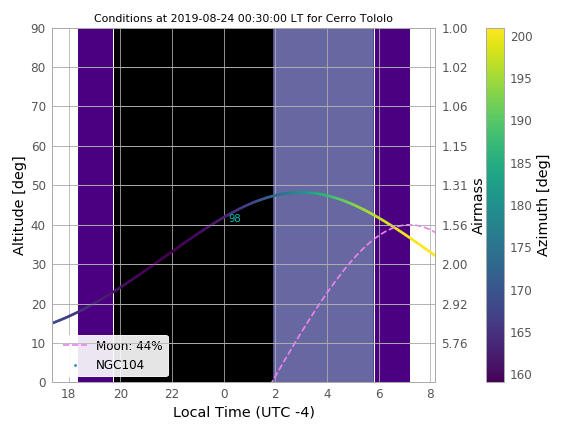
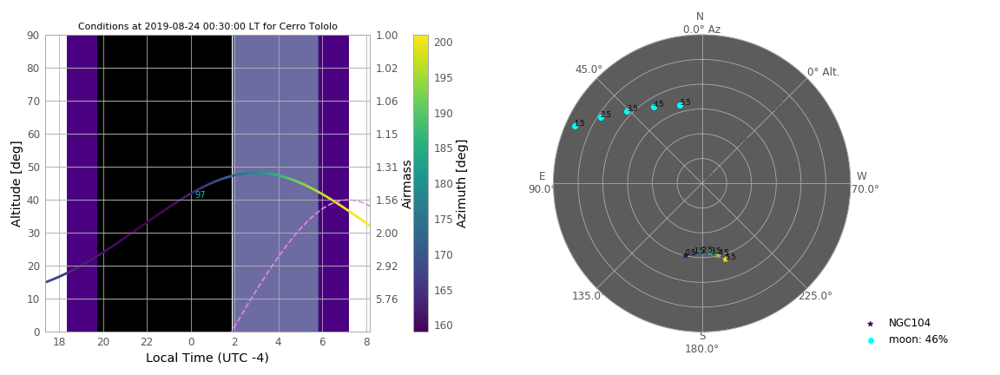
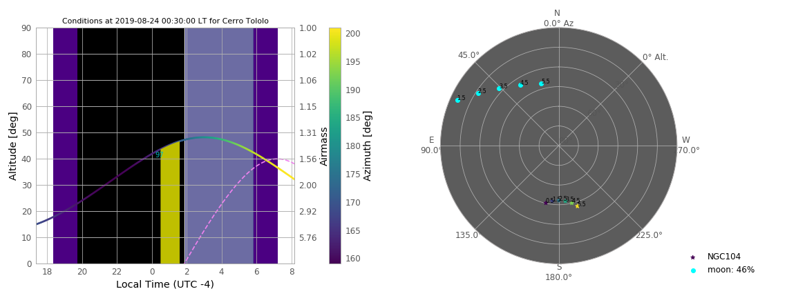
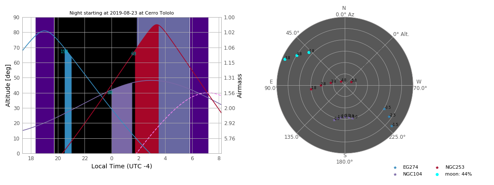
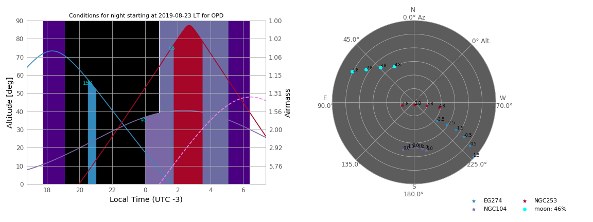

SkyWalker - Python observation planner tool
-------------------------------------------

``Version: 0.4``

By Herpich F. R.  

This tool can be used to plan the nights for virtually any observatory on the Planet. The user can make maps for individual objects or lists containing several of them. It is also possible to define time blocks for every object (individual or in a list). The angular distance to the Moon will always be shown at the given initial time for each object (if none is given, the default is 0 UTC).

Usage
+++++

- to get the full set of options available with the full description:

python skywalker.py --help

Requisites
++++++++++

python 2.7 (not tested with python 3)

numpy  
matplotlib  
astropy  
datetime  
warnings

This code uses a modified version of the Astroplan code (https://astroplan.readthedocs.io/en/latest/), dubbed here myastroplan. All the modified code is included in this repository. If you use this code in your research, please cite accordingly (see https://github.com/astropy/astroplan for the full reference provided by the authors).

Examples
++++++++

``python skywalker.py --object NGC104 --observatory 'Cerro Tololo' -ns 2019-08-23 --at 3 --savechart test01``

``python --object NGC104 --observatory 'Cerro Tololo' -ns 2019-08-23 --at 3 --skychart --savechart test02``

   
``python --object NGC104 --observatory 'Cerro Tololo' -ns 2019-08-23 --at 3 --blocktime 3851 --skychart --savechart test03``

``python -f example_file.csv --observatory 'Cerro Tololo' -ns 2019-08-23 --skychart --savechart test04``

``python -f example_file.csv --sitefile sitefilename_example.csv -ns 2019-08-23 --at 3 --skychart --savechart test05``

